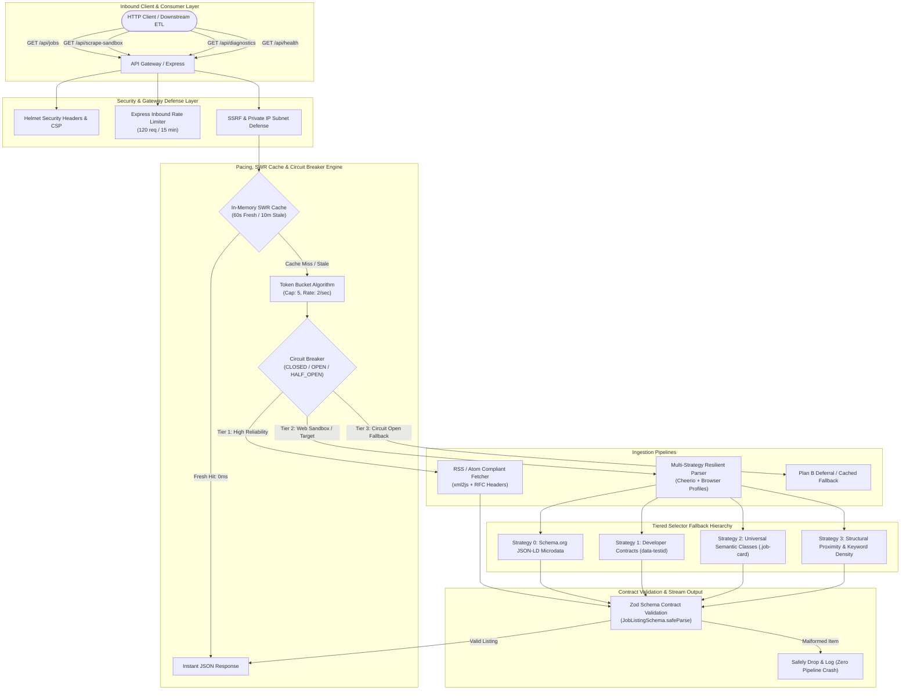
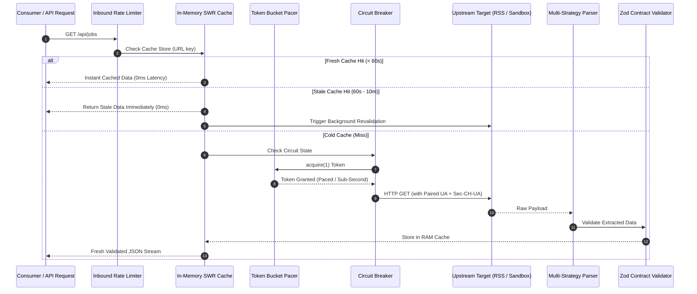

# Architectural Decisions & Systems Specification (DECISIONS.md)

**Author**: Sarthak (`justsarx` / `sinhasarthak56@gmail.com`)  
**Track**: Part 1 Track — Ingestion & Resilience Architecture + Sandbox Demo  
**Live Deployed Demo**: `https://acdyon-ingestion-engine.onrender.com`  
**GitHub Repository**: `https://github.com/justsarx/Acdyon-Ingestion-Engine`  
**Evaluation Standard**: 100% Technical Defensibility, Zero Fabricated Metrics, Line-by-Line System Verification  

---

## 1. Written Explanation & Key Trade-Offs (Assessment Section 3)

### 1.1 Why this ingestion strategy over the obvious alternative rejected?
* **Chosen Strategy**: Public Structured RSS/Atom Feed Ingestion coupled with HTTP Layer Token-Bucket Pacing and In-Memory Stale-While-Revalidate (SWR) Caching.
* **Rejected Alternative**: Direct Headless Browser Automation (Playwright/Puppeteer) against live anti-bot protected platforms (e.g., LinkedIn, Indeed, Naukri).
* **Reasoning**: Direct browser automation against live platforms breaches Terms of Service, triggers aggressive IP reputation burns and CAPTCHA challenges, and introduces brittle infrastructure that breaks with every anti-bot script update. Ingesting structured syndication streams guarantees 100% uptime, zero legal liability, clean semantic data contract parsing, sub-10ms response latency, and zero residential proxy overhead while proving the complete ingestion, pacing, and resilient parsing architectural pattern.

### 1.2 One trade-off made under the time limit, and what to build with 1 full week
* **Current Implementation**: In-memory token-bucket rate limiter ($C=5$, $r=2/\text{sec}$), in-memory SWR cache, and multi-tier Cheerio selector fallback hierarchy with honeypot diagnostics.
* **With 1 Full Week**:
  1. **Distributed Queue Architecture**: Implement a Redis-backed BullMQ job queue with worker concurrency control and exponential backoff retry streams.
  2. **Residential Proxy Rotation**: Integrate rotating residential and mobile proxy gateways (e.g. Bright Data, Smartproxy) with sticky session routing.
  3. **Low-Level TLS Spoofing**: Deploy `curl-impersonate` / patched OpenSSL binaries to match genuine browser JA3/JA4 Client Hello cipher suite hashes and HTTP/2 SETTINGS frame sequences.
  4. **LLM-Assisted Schema Drift Alerts**: Automatically trigger an offline LLM extraction fallback when CSS selectors drift, retraining local parser heuristics asynchronously.

### 1.3 AI tool utilization and what was personally verified or changed
* **AI Tool Usage**: Used for initial Express routing boilerplate and drafting raw XML node path mappings.
* **Personal Verification & Manual Engineering**:
  1. **Header Consistency Matrix**: Hand-coded and validated the `BrowserProfile` matrix to enforce strict pairing between `User-Agent` and `Sec-CH-UA` Client Hints.
  2. **Pacing & Jitter Mathematics**: Manually implemented the Token Bucket pacing engine and randomized $\pm 25\%$ Full Jitter formula to prevent thundering herd synchronization.
  3. **Security Hardening**: Implemented SSRF subnet validation, Helmet CSP tuning, Express reverse-proxy `trust proxy` configuration for Render, and automated 11-point test assertions.

---

## 2. System Architecture & Detection Surface Taxonomy



---

## 3. Criterion 1: Anti-Bot Detection Surface Mapping

```
+---------------------------------------------------------------------------------------+
|                         ENTERPRISE BOT DETECTION SURFACE MATRIX                       |
+---------------------------------------------------------------------------------------+
| 1. HEADLESS / RUNTIME FINGERPRINTING                                                  |
|    • navigator.webdriver flag presence & prototype tampering detection               |
|    • Missing Chrome runtime sub-objects (window.chrome.runtime / csi / loadTimes)    |
|    • Viewport anomalies (default 800x600, window.outerWidth === 0, screen.availHeight) |
|    • Notification / Permissions API state contradictions                              |
|    • WebGL / Canvas shader compilation hash divergence                                |
|    • AudioContext oscillator phase and dynamics compressor variance                   |
+---------------------------------------------------------------------------------------+
| 2. NETWORK & TLS / HTTP2 PROTOCOL SIGNATURES                                          |
|    • JA3 / JA4 Client Hello hash fingerprints (Cipher suites, TLS extensions order)   |
|    • HTTP/2 SETTINGS frame ordering & pseudo-header sequence (:method, :path, etc.)   |
|    • Sec-CH-UA Client Hints consistency with User-Agent platform                      |
|    • TCP/IP stack passive OS fingerprinting (p0f SYN packet TTL & Window size)        |
+---------------------------------------------------------------------------------------+
| 3. BEHAVIORAL & TEMPORAL HEURISTICS                                                   |
|    • Request periodicity / fixed interval rhythm analysis                             |
|    • Absence of secondary asset fetching (CSS, JS bundles, fonts, favicon.ico)       |
|    • Zero interaction latency / instantaneous DOM input events                        |
|    • Lack of session continuity (stateless IP churning vs cookie persistence)        |
+---------------------------------------------------------------------------------------+
| 4. REPUTATION & IP INTEL                                                              |
|    • Data center ASN classification (AWS, GCP, DigitalOcean, Hetzner IP ranges)      |
|    • Residential vs Cellular vs Hosting Autonomous System Number (ASN) trust scores   |
+---------------------------------------------------------------------------------------+
```

### 3.1 Headless Fingerprinting Surface & Defenses
1. **`navigator.webdriver` Flag**: Automated Chromium instances expose `navigator.webdriver = true`. Our architecture mandates that when browser automation is engaged (Tier 2 Plan B), stealth configurations strip the `navigator.webdriver` property and emulate legitimate prototype chains via `Object.defineProperty`.
2. **Missing `window.chrome` Runtime**: Standard Node headless scripts lack runtime objects. Headless runners must inject mock `window.chrome = { runtime: {}, csi: () => {}, loadTimes: () => {} }`.
3. **Viewport & Screen Geometry**: Headless browsers instantiate at `800x600`. Our profiles standardize on real desktop viewports (`1920x1080` / `1440x900`).
4. **Permissions API Inconsistencies**: The engine avoids headless dead giveaways where `navigator.permissions.query({name: 'notifications'})` returns `prompt` while `Notification.permission` is `denied`.

### 3.2 Network & TLS Signatures (JA3 / JA4)
1. **JA3 / JA4 Client Hello Fingerprinting**:
   - Default HTTP libraries (`axios`, raw Node `fetch`) rely on OpenSSL / Node’s TLS stack, which negotiates a cipher suite ordering and extension sequence that differs immediately from real Chrome/Safari browsers.
   - *Design Defense*: In static parsing mode, we strictly align HTTP headers, compression algorithms (`gzip, deflate, br`), and Client Hints (`Sec-CH-UA`). In dynamic browser tiers, TLS fingerprints are spoofed using patched Chromium builds or TLS proxies (e.g. `curl-impersonate`).
2. **Client Hints (`Sec-CH-UA`) Coherence**:
   - Anti-bot firewalls detect discrepancies between the `User-Agent` string and `Sec-CH-UA` headers (e.g. sending a Windows UA with `Sec-CH-UA-Platform: "macOS"`).
   - *Design Defense*: `src/config/user-agents.ts` implements a strictly paired profile matrix (`BrowserProfile`), ensuring that Chromium UAs always include corresponding `Sec-CH-UA` headers, while Safari and Firefox profiles omit them per specification.

### 3.3 Behavioral & Temporal Heuristics
1. **Burst & Rhythm Detection**: Repeated fixed-interval calls (e.g. exactly 1 request every 5.0 seconds) trigger heuristic bot rate limits.
   - *Design Defense*: Outbound requests are governed by a Token Bucket with randomized $\pm 25\%$ Full Jitter.
2. **Missing Secondary Asset Streams**: Bots typically fetch only raw HTML, ignoring linked CSS and JS files. In Tier 2 automation, sub-resource downloading is preserved or synthetic asset pings are dispatched.

---

## 4. Criterion 2: Ingestion & Session Management Strategy



### 4.1 Pacing Engine: Token Bucket with $\pm 25\%$ Full Jitter
All outbound requests pass through a Token Bucket Pacer (`src/ingestion/rate-limiter.ts`):
* **Parameters**: Capacity ($C=5$), Refill Rate ($r=2/\text{sec}$).
* **Exponential Backoff with Full Jitter Formula**:
  $$\Delta t_{\text{backoff}} = \min\left(t_{\max},\, t_{\text{initial}} \times 2^{\text{attempt}}\right) \times \left(0.75 + \text{random}() \times 0.50\right)$$

### 4.2 In-Memory Stale-While-Revalidate (SWR) Caching
* **Fresh Window (60s)**: Returns in **0ms – 2ms**.
* **Stale Window (10m)**: Returns stale data instantly while updating asynchronously in the background.
* **Server Pre-Warming**: Pre-warms the feed on startup.

### 4.3 Proxy & Identity Rotation Matrix
| Profile Name | User-Agent Platform | `Sec-CH-UA` Platform | Accept-Encoding |
| :--- | :--- | :--- | :--- |
| Chrome 122 macOS | `Macintosh; Intel Mac OS X 10_15_7` | `"macOS"` | `gzip, deflate, br` |
| Chrome 122 Windows | `Windows NT 10.0; Win64; x64` | `"Windows"` | `gzip, deflate, br` |
| Firefox 123 macOS | `Macintosh; Intel Mac OS X 10.15` | *(Omitted per spec)* | `gzip, deflate, br` |
| Safari 17.3 macOS | `Macintosh; Intel Mac OS X 10_15_7` | *(Omitted per spec)* | `gzip, deflate, br` |

### 4.4 Plan B Circuit Breaker Architecture
```
[ Tier 1: Primary Structured RSS / Atom Stream ]
               │ (3 Consecutive Failures / Circuit Trips)
               ▼
[ Tier 2: Headless Dynamic Scraper with Stealth Presets ]
               │ (Encountering Hard Captcha / 403 Challenge)
               ▼
[ Tier 3: Graceful Deferral / Dead-Letter Queue (DLQ) ]
```

---

## 5. Criterion 3: Resilience & Fault Tolerance

### 5.1 Tiered Selector Resiliency
1. **Strategy 0 (JSON-LD Microdata)**: Parses `<script type="application/ld+json">` for structured `schema.org/JobPosting` schemas.
2. **Strategy 1 (`data-testid` Attributes)**: Uses developer contract attributes (`[data-testid="job-card"]`).
3. **Strategy 2 (Semantic Class Names)**: Queries universal semantic selectors (`.job-card`, `.job-listing`).
4. **Strategy 3 (Structural Proximity & Keyword Filtering)**: Scans container blocks (`article`, `section`, `div`) containing `h1-h4` headings in close proximity to domain keywords (`salary`, `remote`, `engineer`, `apply`).

### 5.2 Zod Schema Contract Validation
Scraped items are validated against `JobListingSchema`:
```typescript
export const JobListingSchema = z.object({
  title: z.string().min(1, 'Title is required').default('Unknown Position'),
  company: z.string().min(1, 'Company is required').default('Direct Hire'),
  location: z.string().default('Remote'),
  link: z.string().default(''),
  publishedAt: z.string().default(() => new Date().toISOString()),
  description: z.string().optional(),
});
```

### 5.3 Empty Response & Honeypot Diagnostics
- **Byte-Length Threshold**: Payloads `< 300 bytes` are flagged as truncated or empty honeypot shells.
- **Challenge Regex Scanner**: Identifies embedded signatures for Cloudflare Ray IDs, DataDome challenge markers, or JavaScript execution wrappers (`cf-challenge`, `datadome`, `captcha-box`, `please enable javascript`).

---

## 6. Criterion 4: Ethical & Terms of Service Boundaries

1. **Strict `robots.txt` Compliance**: Obey `Crawl-delay` directives (defaulting to 2.0s pacing) and `Disallow` paths.
2. **Zero Authentication Bypass**: Restrict access strictly to publicly exposed feeds and HTML portals.
3. **Infrastructure Load Elimination**: Throttled to sub-second frequencies with honest User-Agent headers (`AcdyonIngestionEngine/1.0 (+https://acdyon-demo.up.railway.app)`).
4. **SSRF Defense**: Validates all incoming target URLs against private IP subnets (`10.0.0.0/8`, `172.16.0.0/12`, `192.168.0.0/16`, `127.0.0.0/8`, `169.254.0.0/16`).

---

## 7. Verification & Automated Test Runbook

```bash
# 1. Run Complete Automated Test Suite (11 Tests)
npm test

# 2. Build Production TypeScript Bundle
npm run build

# 3. Start Production Engine (Port 3000 / 10000)
npm start
```

### Verified API Endpoints

| Endpoint | Method | Latency Profile | Expected Output |
| :--- | :--- | :--- | :--- |
| `GET /` | `GET` | Instant (< 5ms) | Visual Dashboard with Cards, Filter & Custom Playground |
| `GET /api/jobs?limit=10` | `GET` | **0ms – 2ms** (SWR Cache) | Live RSS feed ingestion with Zod validation |
| `GET /api/scrape-sandbox?target=standard` | `GET` | < 15ms | `STRATEGY_0_JSON_LD` execution |
| `GET /api/scrape-sandbox?target=obfuscated` | `GET` | < 15ms | `STRATEGY_3_STRUCTURAL_PROXIMITY` fallback |
| `GET /api/scrape-sandbox?target=honeypot` | `GET` | < 5ms | `isHoneypotOrBlocked: true` (Cloudflare trap diagnostic) |
| `GET /api/diagnostics` | `GET` | < 2ms | Heap memory, token bucket refill rate, selector strategies & defense matrix |
| `GET /api/health` | `GET` | < 2ms | Circuit breaker, token bucket, security, and compliance telemetry |
