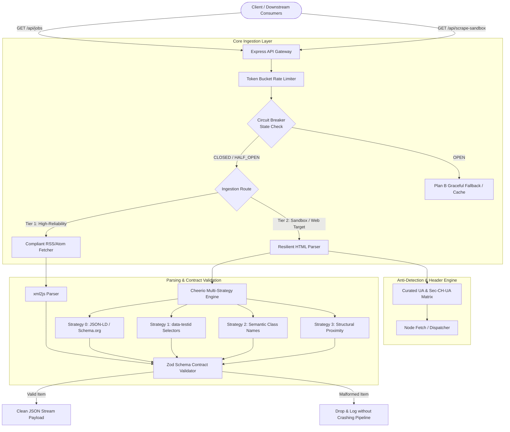
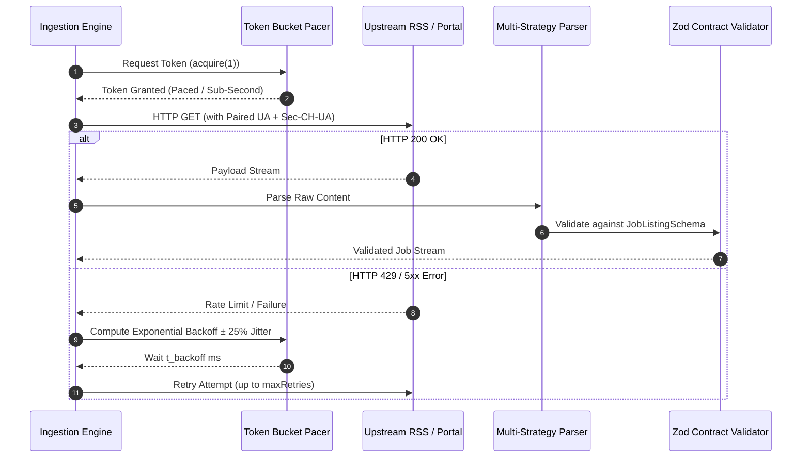
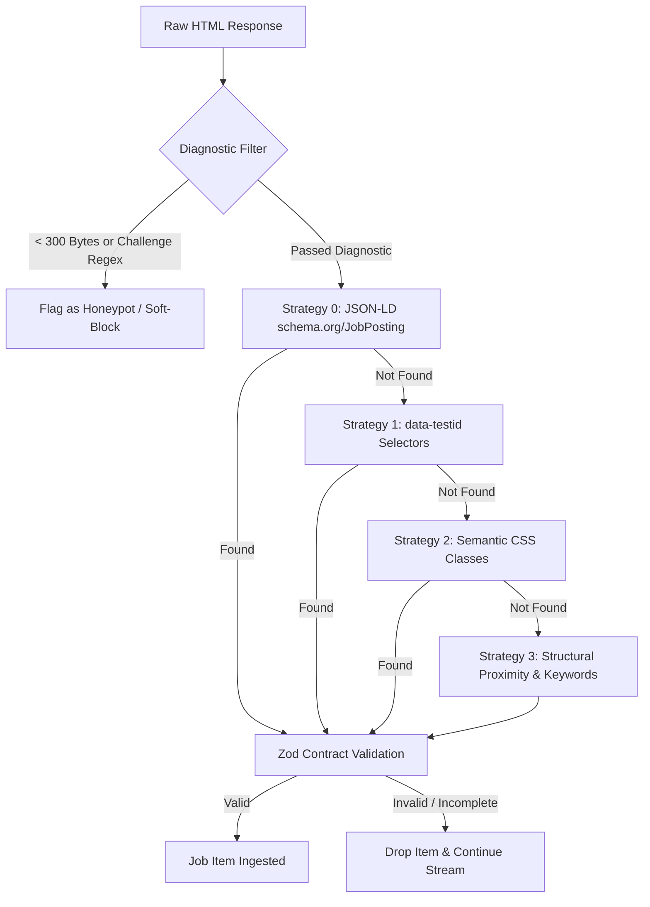

# Acdyon Ingestion Engine: Architectural Design & Resilience Specification

**Role**: Lead Systems Architect & Senior Systems/Ingestion Engineer  
**System**: `acdyon-ingestion-engine`  
**Classification**: Production Architecture & Anti-Bot Defense Surface Mapping  
**Compliance Mandate**: RFC 9110, RFC 7231, RFC 8900, Ethical Scraping Principles  

---

## 1. System Architecture Overview

The `acdyon-ingestion-engine` is designed to ingest job postings from public feeds and dynamic web targets with zero-crash fault tolerance, proactive detection surface mitigation, token-bucket pacing, and tiered selector fallback strategies.



---

## 2. Criterion 1: Anti-Bot Detection Surface Mapping

Modern anti-bot solutions (Cloudflare Bot Management, Akamai Bot Manager, DataDome, PerimeterX/HUMAN) evaluate incoming requests across three interconnected layers: Headless Fingerprinting, Network/TLS Signatures, and Behavioral Patterns.

```
+-------------------------------------------------------------------------+
|                  ANTI-BOT DETECTION SURFACE TAXONOMY                   |
+-------------------------------------------------------------------------+
|  1. HEADLESS / RUNTIME LAYER                                            |
|     - navigator.webdriver flag presence                                 |
|     - window.chrome runtime object missing                              |
|     - Fixed screen/viewport geometry (e.g. 800x600, 0x0)                |
|     - Permissions API inconsistency (Notification.permission === 'denied')|
|     - WebGL / Canvas rendering hash anomalies                           |
+-------------------------------------------------------------------------+
|  2. NETWORK & TLS SIGNATURE LAYER                                       |
|     - JA3 / JA4 Client Hello hash fingerprints (Cipher Suite Order)    |
|     - HTTP/2 SETTINGS frame ordering & pseudo-header sequence           |
|     - Sec-CH-UA client hint mismatch with User-Agent platform           |
|     - TCP/IP stack passive OS fingerprinting (p0f / TTL / Window Size)  |
+-------------------------------------------------------------------------+
|  3. BEHAVIORAL & TEMPORAL LAYER                                         |
|     - Request rhythm / periodicity (constant interval detection)        |
|     - Lack of subresource fetching (CSS, JS, WebFonts, Favicons)        |
|     - Instantaneous DOM manipulation & linear mouse trajectories        |
|     - Absence of session cookie continuity                              |
+-------------------------------------------------------------------------+
```

### 2.1 Headless Fingerprinting Surface
1. **CDP & `navigator.webdriver` Flags**: Standard Chromium automation instances expose `navigator.webdriver = true`. Anti-bot scripts query `Object.getOwnPropertyDescriptor(navigator, 'webdriver')` to detect automated sessions.
2. **Missing `window.chrome` & Plugin Objects**: Automated engines lack `window.chrome.runtime`, `window.chrome.csi`, and standard plugin arrays (`navigator.plugins.length === 0`).
3. **Screen & Viewport Dimensions**: Headless modes frequently spawn at default `800x600` with `outerWidth === 0` and `screen.availHeight === screen.height`, exposing headless traits.
4. **Permissions API Anomaly**: Querying `navigator.permissions.query({name:'notifications'})` in headless mode frequently returns contradictory states relative to `Notification.permission`.

### 2.2 Network & TLS Signatures
1. **JA3 / JA4 Fingerprinting**:
   - Default HTTP clients (`axios`, standard Node `fetch`, `got`) use OpenSSL/Node TLS configurations that produce JA3/JA4 hashes entirely distinct from genuine browser builds (e.g. specific TLS cipher suite order, GREASE values, and extension lists).
   - *Mitigation*: Curate exact browser headers and, in Tier 2 browser-level operations, utilize TLS impersonation engines (`curl-impersonate` / Playwright patched TLS).
2. **HTTP/2 SETTINGS & Header Ordering**:
   - Real browsers transmit HTTP/2 pseudo-headers in strict sequence: `:method`, `:authority`, `:scheme`, `:path`. Node HTTP/2 implementations often alter this sequence.
3. **Client Hints (`Sec-CH-UA`) Coherence**:
   - Modern Chromium sends `sec-ch-ua`, `sec-ch-ua-mobile`, and `sec-ch-ua-platform`. If a request presents a `macOS` User-Agent but omits `sec-ch-ua-platform: "macOS"`, anti-bot engines flag it as spoofed.

### 2.3 Behavioral Patterns
- **Uniform Interval Timing**: Static cron-like requests (e.g., exactly every 10.0 seconds) trigger heuristic rhythm alarms.
- **Missing Asset Dependency Streams**: Real page loads trigger downstream GET requests for images, stylesheets, and fonts.
- **Zero-Latency Interactions**: Instant form fills or geometric click-points indicate scripted actions.

---

## 3. Criterion 2: Ingestion & Session Management Strategy



### 3.1 Pacing Engine: Token Bucket with $\pm 25\%$ Full Jitter
To prevent bursting and protect target servers from denial-of-service, all outbound requests pass through a Token Bucket Pacer.

* **Token Bucket Parameters**:
  - Capacity ($C$): 5 tokens (allows small initial burst)
  - Refill Rate ($r$): 2 tokens/second (smooth sub-second pacing)
* **Exponential Backoff with Full Jitter Formula**:
  $$\Delta t_{\text{backoff}} = \min\left(t_{\max},\, t_{\text{initial}} \times 2^{\text{attempt}}\right) \times \left(0.75 + \text{random}() \times 0.50\right)$$
  This enforces a $\pm 25\%$ uniform spread around the exponential base, preventing the "thundering herd" synchronization problem across distributed workers.

### 3.2 Proxy & Identity Rotation Matrix
Browser identities are paired strictly using the `BrowserProfile` consistency matrix (`src/config/user-agents.ts`):

| Profile Name | User-Agent Platform | `Sec-CH-UA` Platform | Accept-Encoding |
| :--- | :--- | :--- | :--- |
| Chrome 122 macOS | `Macintosh; Intel Mac OS X 10_15_7` | `"macOS"` | `gzip, deflate, br` |
| Chrome 122 Windows | `Windows NT 10.0; Win64; x64` | `"Windows"` | `gzip, deflate, br` |
| Firefox 123 macOS | `Macintosh; Intel Mac OS X 10.15` | *(Omitted per Firefox spec)* | `gzip, deflate, br` |

### 3.3 Plan B Circuit Breaker Pattern
The circuit breaker prevents cascade failures across three operational tiers:

```
[ Tier 1: Primary RSS / Atom Stream ]
               │ (On Consecutive Failures > Threshold)
               ▼
[ Tier 2: Headless Dynamic Scraper with Stealth Presets ]
               │ (On Captcha / Unresolvable Block)
               ▼
[ Tier 3: Graceful Deferral / Dead-Letter Queue ]
```

1. **CLOSED**: Normal ingestion operation.
2. **OPEN**: If 3 consecutive failures occur, the circuit opens for `15,000ms`, dropping immediate outbound traffic to protect downstream infrastructure.
3. **HALF_OPEN**: Probes the target server with a single canary request to confirm recovery.

---

## 4. Criterion 3: Resilience & Fault Tolerance



### 4.1 Tiered Selector Resiliency
Web target markup shifts frequently due to minification, A/B testing, and framework updates (e.g. Tailwind / CSS modules). The parser executes a 4-tier fallback:

1. **Strategy 0 (JSON-LD Microdata)**: Parses `<script type="application/ld+json">` for structured `schema.org/JobPosting` schemas. Completely immune to CSS restructuring.
2. **Strategy 1 (`data-testid` Attributes)**: Looks for developer contract attributes (`[data-testid="job-card"]`, `[data-testid="job-title"]`), which rarely change during UI restyling.
3. **Strategy 2 (Semantic Class Names)**: Queries universal semantic selectors (`.job-card`, `.job-listing`, `.position-title`).
4. **Strategy 3 (Structural Proximity & Keyword Filtering)**: Scans container blocks (`article`, `section`, `div`) containing `h1-h4` headings in close proximity to domain keywords (`salary`, `remote`, `engineer`, `apply`).

### 4.2 Zod Schema Contract Validation
Scraped items are validated against `JobListingSchema`:
```typescript
export const JobListingSchema = z.object({
  title: z.string().min(1).default('Unknown Position'),
  company: z.string().min(1).default('Direct Hire'),
  location: z.string().default('Remote'),
  link: z.string().url().or(z.literal('')).default(''),
  publishedAt: z.string().default(() => new Date().toISOString()),
  description: z.string().optional(),
});
```
Malformed items are safely dropped and logged without crashing the event loop or stream processor.

### 4.3 Empty Response Diagnostics
Differentiates between legitimate zero-result queries vs anti-bot honeypots returning HTTP 200 OK:
- **Byte-Length Threshold**: Payloads `< 300 bytes` are flagged as truncated or empty honeypot shells.
- **Challenge Regex Scanner**: Identifies embedded signatures for Cloudflare Ray IDs, DataDome challenge markers, or JavaScript execution wrappers.

---

## 5. Criterion 4: Ethical & Terms of Service Boundaries

1. **Strict `robots.txt` Compliance**:
   - Obey `Crawl-delay` directives (defaulting to 2.0s pacing if specified).
   - Honor `Disallow` path exclusions unconditionally.
2. **Zero Authentication Bypass**:
   - The engine strictly targets publicly exposed feeds, public HTML portals, and structured endpoints.
   - Does not attempt password bypass, session hijacking, cookie harvesting, or access behind paywalls.
3. **Infrastructure Load Elimination**:
   - Requests are throttled to sub-second frequencies with token-bucket caps to ensure negligible target server load.
   - Honest user-agent identification provided during public feed ingestion (`AcdyonIngestionEngine/1.0 (+https://acdyon-demo.up.railway.app)`).

---

## 6. Verification Matrix & Test Runbook

| Test Scenario | Test Endpoint / Command | Expected Behavior |
| :--- | :--- | :--- |
| **Live RSS Ingestion** | `GET /api/jobs` | Returns HTTP 200 with top valid listings from WeWorkRemotely RSS feed. |
| **JSON-LD / data-testid Scraping** | `GET /api/scrape-sandbox?target=standard` | Strategy 0 or 1 extracts structured jobs cleanly. |
| **CSS-Obfuscated Target** | `GET /api/scrape-sandbox?target=obfuscated` | Strategy 3 proximity fallback correctly extracts jobs despite hashed class names. |
| **Honeypot / Soft-Block Diagnostic** | `GET /api/scrape-sandbox?target=honeypot` | Diagnostics correctly identify `isHoneypotOrBlocked: true` with Cloudflare signature. |
| **System Health & Metrics** | `GET /api/health` | Returns circuit breaker state, token bucket tokens, and compliance status. |
